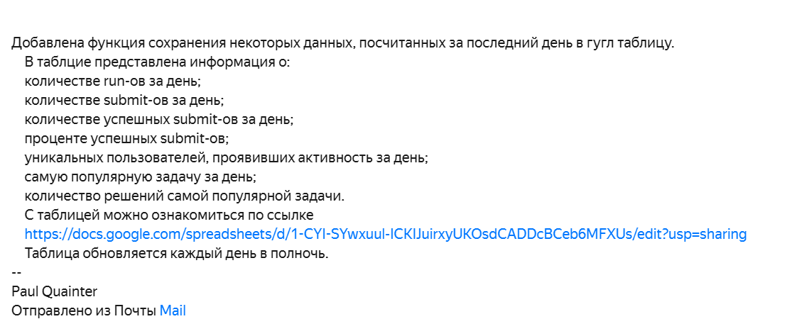
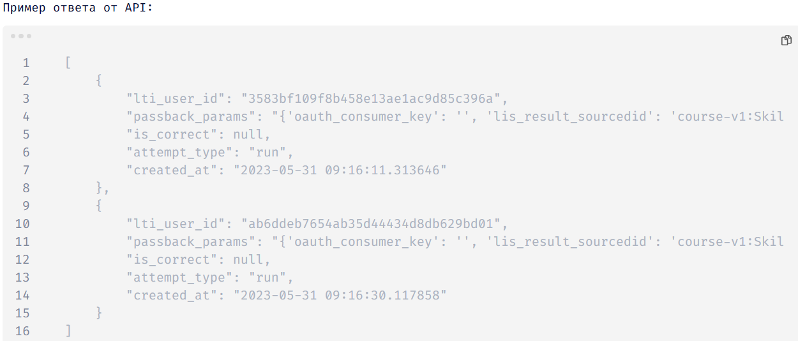
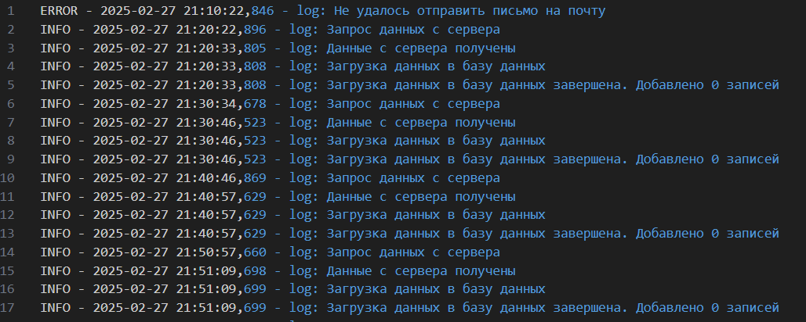
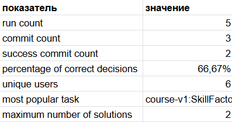

### DATAFLOW TRACKER

---

Программа предназначена для сбора информации через API и запись данных в базу данных.

Для запуска программы необходимо клонировать репозиторий и установить библиотеки. Добавьте в директорию settings файл .env и заполните его согласно шаблону. В settings добавьте json файл с credentials, полученный для работы c Google Sheets.

```
git clone https://github.com/Quainter2510/DataFlow-Tracker.git
pip install -r requirements.txt
python main.py
```

---

### Этапы работы программы

1. При запуске программы отправляется электронное письмо на указанный в .env адрес с оповещением о запуске программы и ее возможностях.
   
2. Каждые 10 минут (время указывается в настройках) происходит запрос на сервер через API.
   
3. Данные валидируются. Неполные записи в базу данных не попадают. После валидации данные записываются в базу данных.
4. На всех этапах работы программы происходит логирование. Логи хранятся в директории logs. Логи хранятся за определенный день, указанный в названии файла. Записями хранятся только за последние 3 дня.
   
5. Каждый день в 23:59 происходит выгрузка данных за последние сутки в Google Sheets. В таблицу записываются следующие данные:

   * количестве run-ов за день;
   * количестве submit-ов за день;
   * количестве успешных submit-ов за день;
   * проценте успешных submit-ов;
   * уникальных пользователей, проявивших активность за день;
   * самую популярную задачу за день;
   * количество решений самой популярной задачи.

     
